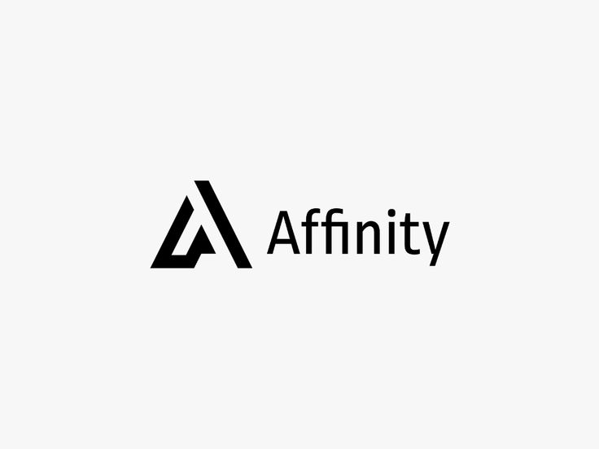
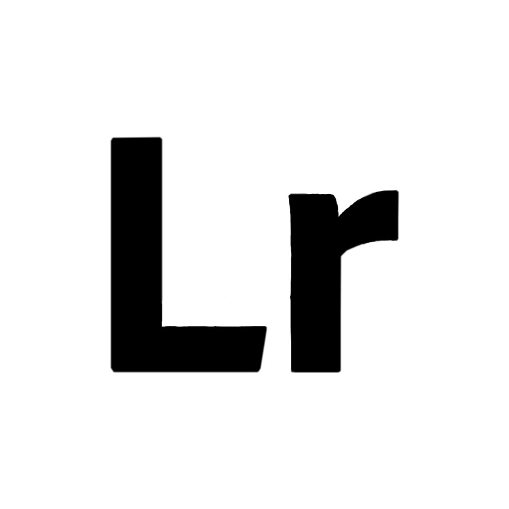
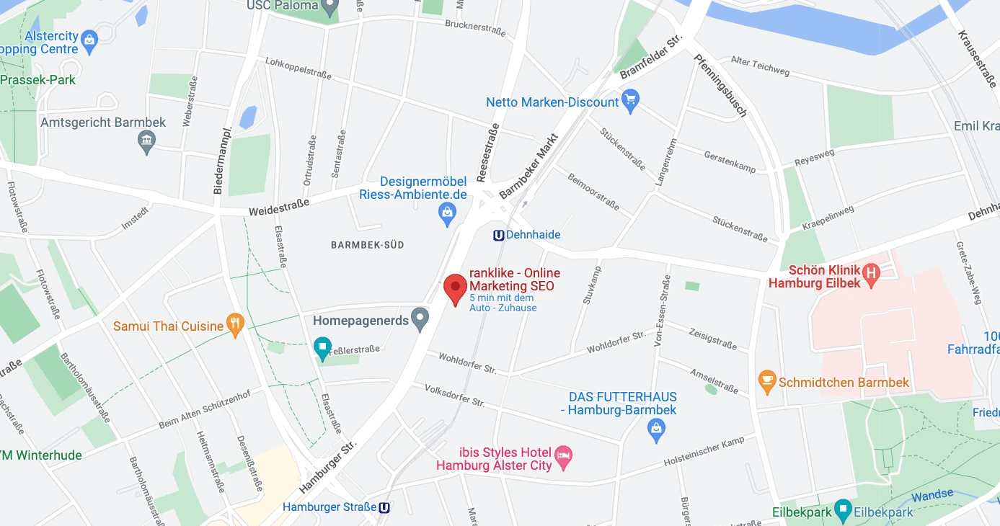

<h1>Dein SEO Experte</h1>

<h1>Wir sind ranklike - SEO Experten aus Hamburg - Deine SEO-Agentur</h1>

  

<h2>#1 SEO Beratung in Hamburg</h2>

<a href="https://ranklike.de/">ranklike - SEO Experte Hamburg</a> ist die Lösung für KMU und Start-ups, die mehr Sichtbarkeit in den Suchergebnissen erreichen möchten. Wir sind spezialisiert auf lokale Suchmaschinenoptimierung (<a href="https://ranklike.de/local-seo/ ">Local SEO</a>) sowie OnPage-SEO, um Dir eine effektive Möglichkeiten zu bieten, das Ranking Deiner Website bei Google und anderen Suchmaschinen zu verbessern. ranklike SEO Hamburg macht es einfach, Dein lokales Publikum anzusprechen, sodass Du dich auf das konzentrieren kannst, was Du am besten kannst – Dein Unternehmen führen.

 

<!--  -->

<!--  -->

 

       
- 🚀 Über 12+ Jahre Erfahrung im digitalen Marketing Umfeld 
- ⚡️ Spezialisiert auf Suchmaschinenoptimierung 
- 🎯 Maßgeschneiderte SEO-Lösungen 
- 🔎 Online-Shop SEO und Website Optimierungen
- 📌 Professionelle und zuverlässige SEO-Beratung   

       
  

   

    
    
    

<h4>SEO Hamburg</h4>

Deine <a href="https://ranklike.de/">SEO Hamburg Agentur </a>die für Deine Website mehr Traffic generiert.  

<h3>Tools die wir nutzen</h3>

<h4 style="display: inline;">Suchmaschinenoptimierung</h4>

<a href="https://ranklike.de/local-seo/ ">Effektive Suchmaschinenoptimierung</a> verbessert nachhaltig die Position
Deiner Website im Internet. Entdecke alle unsere SEO-Leistungen.  

<h4>SEO-Experte</h4>

Mit unserer SEO-Beratung erhältst Du einen <a href="https://ranklike.de/seo-experte/">SEO-Experten</a> für eine
individuelle SEO-Lösung.  

<h4>Local SEO</h4>
<a href="https://ranklike.de/local-seo/">Lokale Suchmaschinenoptimierung die Local-SEO</a>, für eine höhere
Platzierung in den lokalen Suchanfragen.  

<h4>E-Commerce SEO</h4>
Eine effektive <a href="https://ranklike.de/e-commerce-seo/">E-Commerce SEO</a> Lösung für Produkte und Onlineshops.
Besser ranken!  

<h4>OffPage-SEO</h4>
Mit der passenden <a href="https://ranklike.de/offpage-seo/">OffPage Strategie</a>, erhöhen wir die Autorität und
das Vertrauen Deiner Website.  

<h4>OnPage Optimierung</h4>
<a href="https://ranklike.de/onpage-seo/">OnPage-Optimierungen</a> Deiner Website-Inhalte, um maßgeblich die
Sichtbarkeit zu steigern.  

<h4>Technisches-SEO</h4>
Durch die <a href="https://ranklike.de/technisches-seo/">Technische SEO</a> ergreifen wir alle technischen Maßnahmen
zur Verbesserung Deiner Rankings.  

<h4>Bilder SEO</h4>
Als erfahrener Experte für <a href="https://ranklike.de/bilder-seo/">Bilder-SEO</a> profitieren Du von einer
maximalen Optimierung für Bilder und Grafiken.  

<h4>Site-Audit</h4>
Mit einer umfangreichen <a href="https://ranklike.de/site-audit/">Site-Audit Seitenanalyse </a>finden Sie schnell
Optimierungsmöglichkeiten.  

<h4>Keyword Analyse</h4>
Die <a href="https://ranklike.de/keyword-analyse/">Keyword Analyse</a> dient Dir als Grundlage
sämtlicher Suchmaschinenoptimierung  

<h4>Backlinkaufbau</h4>
Klasse statt Masse! Mit einem autoritären <a href="https://ranklike.de/backlinkaufbau/">Backlinkaufbau </a>steigern
wir Deine Sichtbarkeit.

 
 

<h3>Tools die wir nutzen</h3>

        
        
        
        
        
        
        
        

 
 

<h3>Was wir können</h3>
<table>
        <tr>
            <td align="center" width="96" style="border:1px solid #3A424A">
                
                 HTML
            </td>
            <td align="center" width="96" style="border:1px solid #3A424A">
                
                 CSS
            </td>
            <td align="center" width="96" style="border:1px solid #3A424A">
                
                 Javascript
            </td>
            <td align="center" width="96" style="border:1px solid #3A424A">
                
                 Bootstrap
            </td>
            <td align="center" width="96" style="border:1px solid #3A424A">
                
                 ebay
            </td>
            <td align="center" width="96" style="border:1px solid #3A424A">
                
                 amazon
            </td>
            <td align="center" width="96" style="border:1px solid #3A424A">
                
                 shopify
            </td>
            <td align="center" width="96" style="border:1px solid #3A424A">
                
                 Wordpress
            </td>
            <td align="center" width="96" style="border:1px solid #3A424A">
                
                 woocommerce
            </td>
            <td align="center" width="96" style="border:1px solid #3A424A">
                
                 Prestashop
            </td>
            <td align="center" width="96" style="border:1px solid #3A424A">
                
                 xt-commerce
            </td>
            </td>
            <td align="center" width="96" style="border:1px solid #3A424A">
                
                 wix
            </td>
            </td>
            <td align="center" width="96" style="border:1px solid #3A424A">
                
                 shopware
            </td>
            </td>
            <td align="center" width="96" style="border:1px solid #3A424A">
                
                 G-cloud
            </td>
            <td align="center" width="96" style="border:1px solid #3A424A">
                
                 aws
            </td>
            <td align="center" width="96" style="border:1px solid #3A424A">
                
                 azure
            </td>
        </tr>
</table>

 
 

<h3>Verbinde dich mit uns</h3>

    <a href="https://twitter.com/ranklike"><svg width="48" height="48" viewBox="0 0 48 48" fill="none" xmlns="http://www.w3.org/2000/svg"><path fill-rule="evenodd" clip-rule="evenodd" d="M0 24C0 10.7452 10.7452 0 24 0C37.2548 0 48 10.7452 48 24C48 37.2548 37.2548 48 24 48C10.7452 48 0 37.2548 0 24ZM23.2812 19.5075L23.3316 20.338L22.4922 20.2363C19.4369 19.8465 16.7677 18.5245 14.5013 16.3043L13.3934 15.2027L13.108 16.0162C12.5036 17.8296 12.8897 19.7448 14.1488 21.0328C14.8203 21.7446 14.6692 21.8463 13.5109 21.4226C13.108 21.287 12.7554 21.1854 12.7219 21.2362C12.6044 21.3548 13.0073 22.8971 13.3262 23.5072C13.7627 24.3546 14.6524 25.1851 15.6261 25.6766L16.4487 26.0664L15.475 26.0833C14.5349 26.0833 14.5013 26.1003 14.6021 26.4562C14.9378 27.5578 16.264 28.7272 17.7413 29.2357L18.7822 29.5916L17.8756 30.1339C16.5326 30.9135 14.9546 31.3542 13.3766 31.3881C12.6211 31.405 12 31.4728 12 31.5237C12 31.6931 14.0481 32.6422 15.24 33.0151C18.8157 34.1167 23.063 33.6422 26.2526 31.7609C28.5189 30.422 30.7852 27.7612 31.8428 25.1851C32.4136 23.8123 32.9844 21.304 32.9844 20.1007C32.9844 19.3211 33.0347 19.2194 33.9748 18.2872C34.5288 17.7449 35.0492 17.1517 35.15 16.9822C35.3178 16.6602 35.3011 16.6602 34.4449 16.9483C33.018 17.4568 32.8165 17.389 33.5216 16.6263C34.042 16.084 34.6631 15.101 34.6631 14.8129C34.6631 14.762 34.4113 14.8468 34.1259 14.9993C33.8238 15.1688 33.1523 15.423 32.6486 15.5756L31.7421 15.8637L30.9195 15.3044C30.4663 14.9993 29.8283 14.6604 29.4926 14.5587C28.6364 14.3214 27.327 14.3553 26.5548 14.6265C24.4563 15.3891 23.1301 17.3551 23.2812 19.5075Z" fill="#00fdb0"/></svg></a>
    
    
    
    
    
    
    
           
    

 

 
 

            
<h4>Deine Experten für SEO Hamburg</h4>

  

Hier findet Ihr unser <a href="https://goo.gl/maps/gxpX35xVxXkvHy9j8">Hamburg SEO Experten Profil</a> in den Maps.

Wir nehmen gerne Eure Anfragen entgegen unter: <a href="https://ranklike.de/kontakt/">SEO-Anfrage starten</a>
