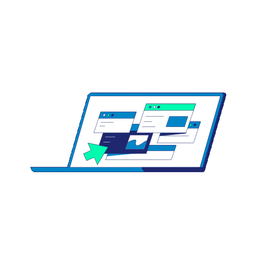
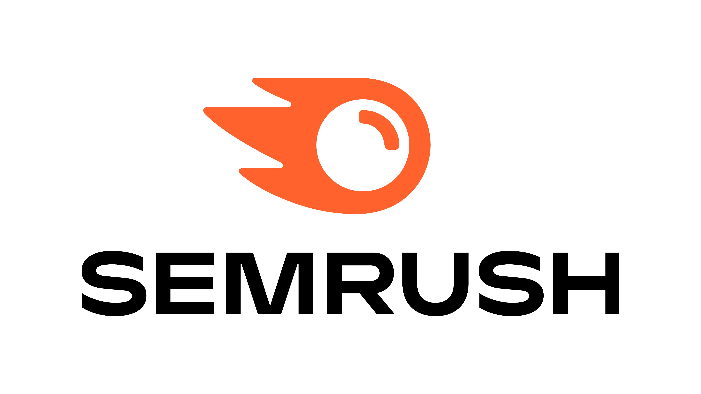
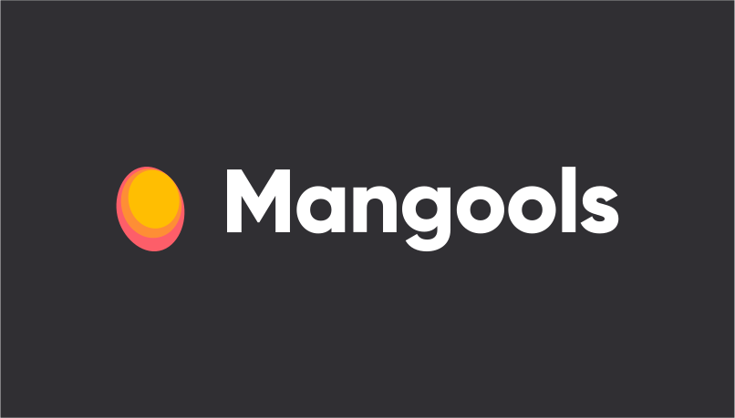
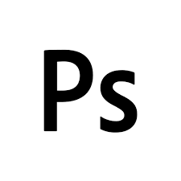
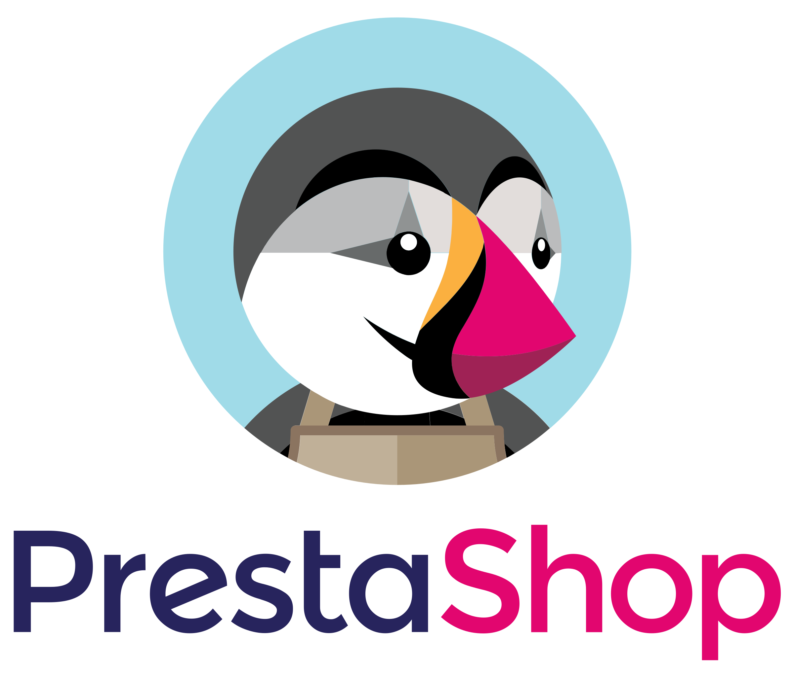

<h1>Dein SEO Experte</h1>

<h1>Wir sind ranklike - SEO Experten aus Hamburg - Deine SEO-Agentur</h1>

<h2>#1 SEO Beratung in Hamburg</h2>

<a href="https://ranklike.de/">ranklike - SEO Experte Hamburg</a> ist die Lösung für KMU und Start-ups, die mehr Sichtbarkeit in den Suchergebnissen erreichen möchten. Wir sind spezialisiert auf lokale Suchmaschinenoptimierung (<a href="https://ranklike.de/local-seo/ ">Local SEO</a>) sowie OnPage-SEO, um Dir eine effektive Möglichkeiten zu bieten, das Ranking Deiner Website bei Google und anderen Suchmaschinen zu verbessern. ranklike SEO Hamburg macht es einfach, Dein lokales Publikum anzusprechen, sodass Du dich auf das konzentrieren kannst, was Du am besten kannst – Dein Unternehmen führen.

<h3>Unser SEO MehrWERT</h3>
        🚀 Über 12+ Jahre Erfahrung im digitalen Marketing Umfeld  
        ⚡️ Spezialisiert auf Suchmaschinenoptimierung  
        🎯 Maßgeschneiderte SEO-Lösungen  
        🔎 Online-Shop SEO und Website Optimierungen  
        📌 Professionelle und zuverlässige SEO-Beratung

  

<h4>SEO Hamburg</h4>
Deine <a href="https://ranklike.de/">SEO Hamburg Agentur </a>die für Deine Website mehr Traffic generiert.  

<h4>Suchmaschinenoptimierung</h4>
<a href="https://ranklike.de/local-seo/ ">Effektive Suchmaschinenoptimierung</a> verbessert nachhaltig die Position
Deiner Website im Internet. Entdecke alle unsere SEO-Leistungen.  

<h4>SEO-Experte</h4>
Mit unserer SEO-Beratung erhältst Du einen <a href="https://ranklike.de/seo-experte/">SEO-Experten</a> für eine
individuelle SEO-Lösung.  

<h4>Local SEO</h4>
<a href="https://ranklike.de/local-seo/">Lokale Suchmaschinenoptimierung die Local-SEO</a>, für eine höhere
Platzierung in den lokalen Suchanfragen.  

<h4>E-Commerce SEO</h4>
Eine effektive <a href="https://ranklike.de/e-commerce-seo/">E-Commerce SEO</a> Lösung für Produkte und Onlineshops.
Besser ranken!  

<h4>OffPage-SEO</h4>
Mit der passenden <a href="https://ranklike.de/offpage-seo/">OffPage Strategie</a>, erhöhen wir die Autorität und
das Vertrauen Deiner Website.  

<h4>OnPage Optimierung</h4>
<a href="https://ranklike.de/onpage-seo/">OnPage-Optimierungen</a> Deiner Website-Inhalte, um maßgeblich die
Sichtbarkeit zu steigern.  

<h4>Technisches-SEO</h4>
Durch die <a href="https://ranklike.de/technisches-seo/">Technische SEO</a> ergreifen wir alle technischen Maßnahmen
zur Verbesserung Deiner Rankings.  

<h4>Bilder SEO</h4>
Als erfahrener Experte für <a href="https://ranklike.de/bilder-seo/">Bilder-SEO</a> profitieren Du von einer
maximalen Optimierung für Bilder und Grafiken.  

<h4>Site-Audit</h4>
Mit einer umfangreichen <a href="https://ranklike.de/site-audit/">Site-Audit Seitenanalyse </a>finden Sie schnell
Optimierungsmöglichkeiten.  

<h4>Keyword Analyse</h4>
Die <a href="https://ranklike.de/keyword-analyse/">Keyword Analyse</a> dient Dir als Grundlage
sämtlicher Suchmaschinenoptimierung  

<h4>Backlinkaufbau</h4>
Klasse statt Masse! Mit einem autoritären <a href="https://ranklike.de/backlinkaufbau/">Backlinkaufbau </a>steigern
wir Deine Sichtbarkeit.  

 

<h3>Tools die wir nutzen</h3>

        
        
        
        
        
        
        
        

 

<h3>Was wir können</h3>
<table>
        <tr>
            <td align="center" width="96" style="border:1px solid #3A424A">
                
                 HTML
            </td>
            <td align="center" width="96" style="border:1px solid #3A424A">
                
                 CSS
            </td>
            <td align="center" width="96" style="border:1px solid #3A424A">
                
                 Javascript
            </td>
            <td align="center" width="96" style="border:1px solid #3A424A">
                
                 Bootstrap
            </td>
            <td align="center" width="96" style="border:1px solid #3A424A">
                
                 ebay
            </td>
            <td align="center" width="96" style="border:1px solid #3A424A">
                
                 amazon
            </td>
            <td align="center" width="96" style="border:1px solid #3A424A">
                
                 shopify
            </td>
            <td align="center" width="96" style="border:1px solid #3A424A">
                
                 Wordpress
            </td>
            <td align="center" width="96" style="border:1px solid #3A424A">
                
                 woocommerce
            </td>
            <td align="center" width="96" style="border:1px solid #3A424A">
                
                 Prestashop
            </td>
            <td align="center" width="96" style="border:1px solid #3A424A">
                
                 xt-commerce
            </td>
            </td>
            <td align="center" width="96" style="border:1px solid #3A424A">
                
                 wix
            </td>
            </td>
            <td align="center" width="96" style="border:1px solid #3A424A">
                
                 shopware
            </td>
            </td>
            <td align="center" width="96" style="border:1px solid #3A424A">
                
                 G-cloud
            </td>
            <td align="center" width="96" style="border:1px solid #3A424A">
                
                 aws
            </td>
            <td align="center" width="96" style="border:1px solid #3A424A">
                
                 azure
            </td>
        </tr>
</table>

 

<h3>Verbinde dich mit uns</h3>

 
        
        
        
        
        
        
        
        
 

 

            
<h4>Deine Experten für SEO Hamburg</h4>
<iframe src="https://www.google.com/maps/embed?pb=!1m18!1m12!1m3!1d2368.8584170695062!2d10.039489!3d53.578143399999995!2m3!1f0!2f0!3f0!3m2!1i1024!2i768!4f13.1!3m3!1m2!1s0x0%3A0xfde4ac845b7be47e!2sranklike%20-%20Online%20Marketing%20SEO!5e0!3m2!1sde!2spt!4v1662304099388!5m2!1sde!2spt"
                width="600" height="450" style="border:0;" allowfullscreen="" loading="lazy"
                referrerpolicy="no-referrer-when-downgrade">ranklike - Online Marketing SEO Hamburg, Hamburger Straße
                180,
                22083 Hamburg</iframe>

  

Hier findet Ihr unser <a href="https://goo.gl/maps/gxpX35xVxXkvHy9j8">Hamburg SEO Experten Profil</a> in den Maps.

Wir nehmen gerne Eure Anfragen entgegen unter: <a href="https://ranklike.de/kontakt/">SEO-Anfrage starten</a>
